## 一、项目说明

本开源项目技术栈是SpringBoot，MybatisPlus，Vue，Element-Plus。通过简洁实用的方式整合这些最新技术版本，使得该项目便于开发、调试与交付。
希望它能为你的学习和开发工作带来帮助与借鉴。对于想从零快速搭建项目框架的开发者
或者喜欢纯粹原生组件无过度封装的学习者来说，本项目无疑是个很棒的选择。克隆项目后可以快速配置并启动。
## 二、开发环境
### 后端
    后端的依赖非常精简，基本以spring相关为主
- Java 21  # 使用了当前最新版本的springboot，建议java版本为21，如果要使用17的话需要修改pom中<java.version></java.version>
- SpringBoot 4.0
- MyBatisPlus 3.5
- MySQL 8.0 # 5.7也可以
- Redis 5.0
- Maven 3.9
### 前端
- Node 22
- Vite 7.2
- Vue 3.5
- Element-Plus 2.11
- Pinia 3.0
- Router 4.6
- Axios 1.13

## 三、功能简介

### 系统登录
默认内置 [admin/123456] 账号，拥有所有权限
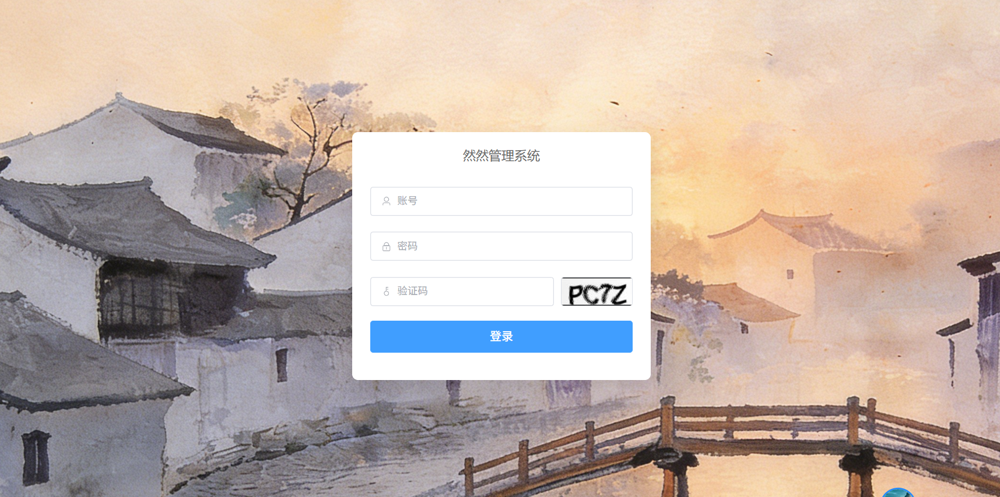

### 系统首页
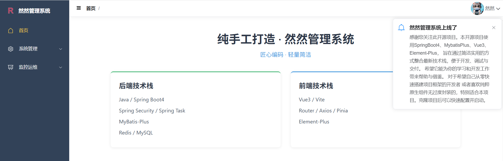

### 个人中心
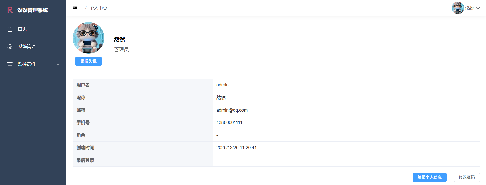

### 用户管理
管理员账号默认禁止删除和禁用，其他用户新增修改均可操作，删除需要注意有无在角色中绑定，需要解绑后才可删除
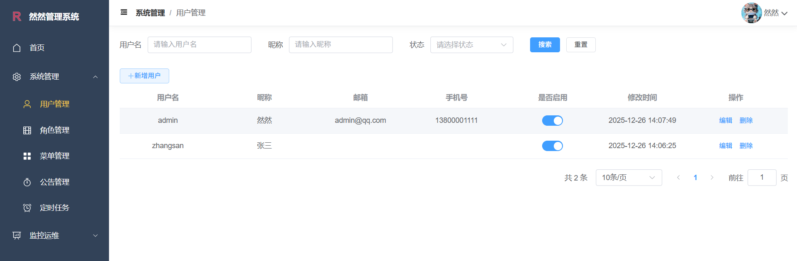

### 菜单管理
添加新菜单，要求在前端代码中views目录下有对应的页面文件,比如添加图书管理菜单：
- 组件路径：system/book/index
- 权限字符串建议用组件路径斜杠转冒号：system:book:index
- 图标选择：点击输入框会弹窗供选择图标
- 菜单类型：目录/菜单/按钮，当前只用到了目录和菜单，按钮类型预留

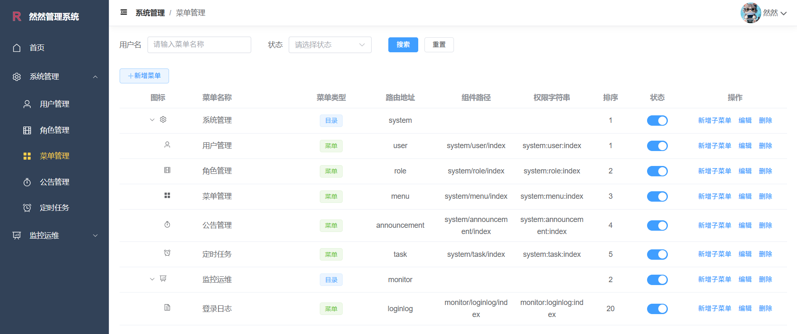

### 角色管理
角色页面，基本的增删改查功能，注意选择对应菜单时，父级菜单不会自动勾选，需要手动勾选。
角色在删除的时候会校验是否有用户绑定，有绑定则不允许删除
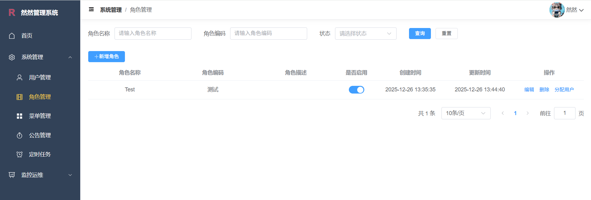
其中分配用户点击后会跳转到用户列表，可以添加或者删除角色对应的用户
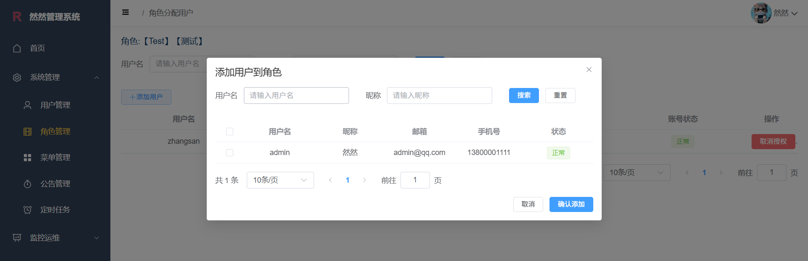

### 公告管理
公告的新增目前简单用了输入框，后续可以改成富文本编辑器
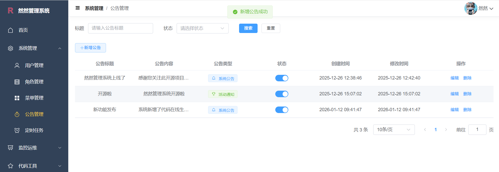
公告发布后，登录系统时会在首页弹窗显示，点击关闭后不会再显示

### 定时任务
定时任务后台基于SpringTask实现
当前只实现了简单的cron表达式配置和启动停止功能
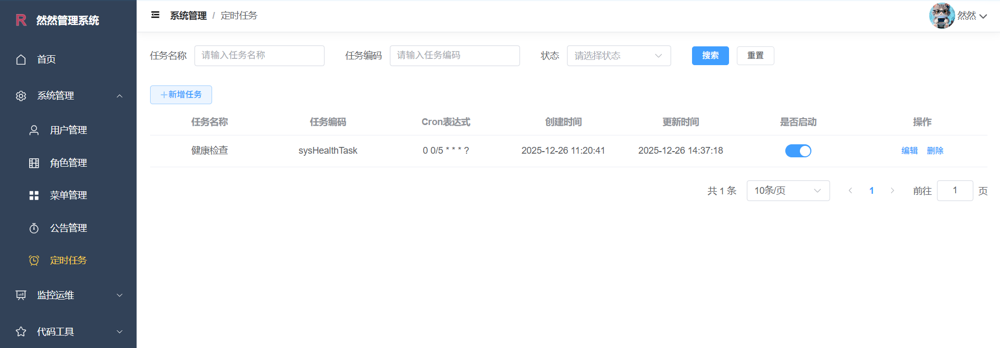

### 代码生成
展示了当前数据库对应的所有表，并提供在线输入相关参数实时生成代码，后端是支持传递数据库名参数的，
有需要的可以加上这个参数dbName（此功能最好不开放）
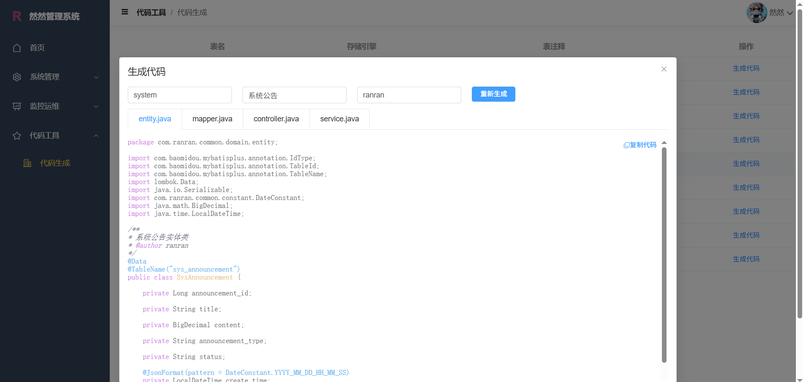

### 监控日志
后台在登录时简单记录了登录日志，可自行删去
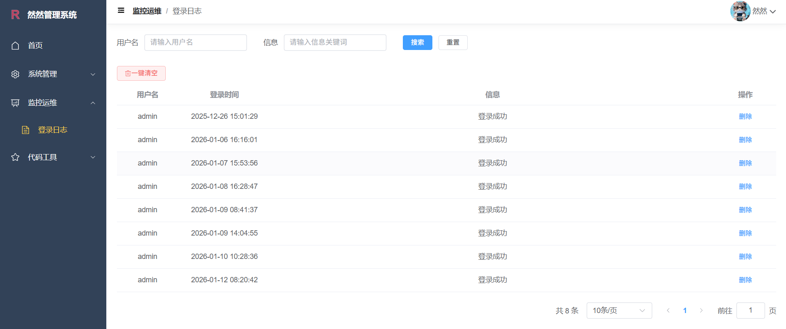

### 系统配置
如果系统有些配置参数需要保存到数据库同时需要保存到redis的，可以在这里添加并在系统中使用，配置类型简单分为系统和普通两种
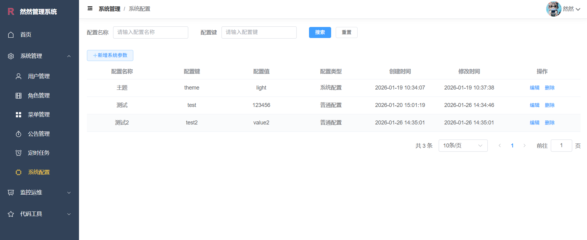

## 四、本地开发环境搭建
### 1、数据库初始化
直接在mysql中执行sql目录下的 `ranran.sql` 脚本即可创建所需的数据库表和几行初始数据；保证redis可用
### 2、后端环境搭建
- 安装JDK 21，并配置好环境变量
- 安装Maven 3.9，也可以使用idea中自带的maven
- 使用IDEA打开后端代码，等待依赖下载完成，或者手动点击maven的更新依赖按钮
- 修改 `src/main/resources/application-dev.yml` 中的Mysql、Redis连接配置为你本地的配置
- 运行 `com.ranran.RanranApplication` 启动后端服务，默认端口8080

### 3、前端环境搭建
- 安装Node 22，并配置好环境变量
- 使用VsCode打开前端代码，或者使用命令行进入前端代码目录
- 执行 `npm install` 安装依赖
- 前端代码中vite.config.js文件中配置了代理，默认指向本地的8080端口，如有需要可自行修改
  target: 'http://localhost:8080/'
- 执行 `npm run dev` 启动前端服务，默认端口为80
- 浏览器访问 `http://localhost` 即可看到系统登录页面

## 五、项目代码结构说明
### 1、后端代码结构
- ranran              # 项目根目录，可以在此目录下执行mvn打包命令等
  - ranran-api          # 接口模块，主要存放Controller层代码
  - ranran-common       # 通用模块，主要存放公共的工具类、常量类、枚举类等
  - ranran-persistence  # 系统模块，主要存放实体类、Service类、Mapper接口、XML映射文件等
  - ranran-framework    # 框架模块，主要存放spring和其他依赖的相关配置，如安全配置、缓存配置等
  - ranran-generator    # 代码生成模块，主要存放代码生成相关的数据库查询，业务逻辑处理和接口

### 2、前端代码结构
- ranran-ui           # 前端代码根目录
  - public              # 静态资源目录
  - src                 # 源代码目录
    - api               # 存放所有请求后端接口相关代码
    - assets            # 存放静态资源，如图片、字体等
    - components        # 存放公共组件
    - views             # 存放各个页面组件，开发时主要在此目录下新增页面
    - store             # 存放Pinia状态管理相关代码
    - router            # 存放路由相关代码
    - utils             # 存放工具类函数
    - App.vue          # 根组件
    - main.js          # 入口文件
